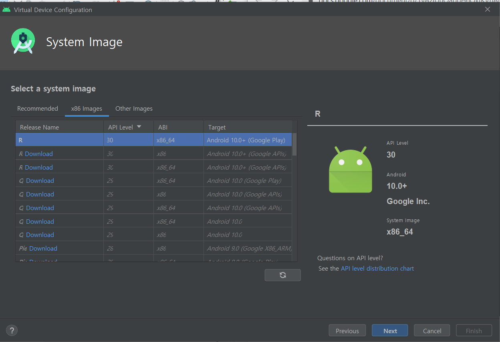

</head><body class="c11"><ol class="c3 lst-kix_t7hye0y43ym4-0 start" start="1"><li class="c2 c5">&#50504;&#46300;&#47196;&#51060;&#46300;?</li></ol>
&#54532;&#47112;&#51076;&#50892;&#53356;: &#47784;&#48148;&#51068; &#50612;&#54540;&#47532;&#52992;&#51060;&#49496;&#51032; &#48736;&#47480; &#44060;&#48156;&#51012; &#50948;&#54620; &#54540;&#47019;&#54268;

OS&#50500;&#45784;. &#47532;&#45573;&#49828;(OS)&#52964;&#45328; &#50948;&#50640; &#50732;&#47532;&#45716; &#44163;.
<ul class="c3 lst-kix_nubmuipc3710-0 start"><li class="c2 c5">&#47785;&#52264;</li></ul><ul class="c3 lst-kix_zcong2k56bs9-0 start"><li class="c1 c5">&#47700;&#51064;&#51060; &#50630;&#45796;. &#52395; &#54168;&#51060;&#51648;&#47564; &#51080;&#51012;&#49104;</li><li class="c1 c5">4&#45824; &#52980;&#54252;&#45324;&#53944;</li></ul><ol class="c3 lst-kix_i8v4htegmwtj-0 start" start="1"><li class="c7 c5 c8">Activity(&#54532;&#47200;&#53944;): &#50612;&#54540;&#47532;&#52992;&#51060;&#49496; &#49892;&#54665;&#54616;&#47732; &#46888;&#45716; &#54868;&#47732; 1&#44060;1&#44060;&hellip; &#44592;&#45733;&#50640; &#46384;&#46972;&#49436; &#52636;&#47141;&#46104;&#45716; &#54868;&#47732;&#46308;. (activity api&#49345;&#49549; &#48155;&#50500;&#49436; &#44396;&#54788;&#54620;&#45796;)</li><li class="c7 c5 c8">service: ui &#54596;&#50836; &#50630;&#51060; &#51648;&#51221;&#46104;&#51648; &#50506;&#51008; &#49884;&#44036;&#46041;&#50504; &#50500;&#47000;&#50640;&#49436; &#46028;&#50500;&#44048;</li><li class="c7 c5 c8">broadcast receiver : &#51068;&#51221; &#46041;&#51089;&#51012; &#48155;&#51012; &#46412; &#49324;&#50857;. ex. &#47928;&#51088;&#47700;&#49464;&#51648; &#48155;&#51012; &#44221;&#50864;, &#48155;&#45716; &#54532;&#47196;&#44536;&#47016;&#51012; &#47564;&#46308;&#50612;&#49436; &#44228;&#49549; &#44592;&#45796;&#47548;. &#48155;&#51004;&#47732; &#50508;&#47548;.</li><li class="c7 c5 c8">content provider: &#45796;&#47480; &#50545;&#44284; db&#47484; &#44277;&#50976;&#54644;&#50556; &#54624; &#44221;&#50864; &#49324;&#50857;.</li></ol>
*&#54616;&#45208;&#51032; &#54532;&#47196;&#44536;&#47016;&#50640;&#49436; &#49324;&#50857;&#54616;&#45716; &#45936;&#51060;&#53552;&#47484; &#45796;&#47480; &#50545;&#44284; &#44277;&#50976;&#54616;&#51648; &#50506;&#51020;. ex. &#50724;&#46972;&#53364; &#53580;&#51060;&#48660;&#51012; &#54616;&#45208;&#51032; &#50937; &#50612;&#54540;&#47532;&#52992;&#51060;&#49496;&#50640;&#49436;&#47564; &#50424; &#49688; &#51080;&#45716; &#49480;. &#54616;&#45208;&#51032; &#50612;&#54540;&#50640;&#49436;&#47564;&#46304; db &#54028;&#51068; &#54644;&#45817; &#50612;&#54540;&#50640;&#49436;&#47564; &#49324;&#50857;&#44032;&#45733;. 

ex. &#52852;&#53665; &#50672;&#46973;&#52376; &#44592;&#45733;, &#49324;&#51652; &#54200;&#51665; &#50612;&#54540;&#47532;&#52992;&#51060;&#49496;&hellip;.
<ul class="c3 lst-kix_8i1ciwctovat-0 start"><li class="c1 c5">JNI(Java Native Interface) : &#51088;&#48148;&#50752; c&#47484; &#50672;&#46041;&#54624; &#46412; &#49324;&#50857;&#54616;&#45716; &#51064;&#53552;&#54168;&#51060;&#49828;</li></ul><ul class="c3 lst-kix_w9fupqxd5r-0 start"><li class="c2 c5">&#53945;&#51669;</li></ul><ul class="c3 lst-kix_picx1twl2z3n-0 start"><li class="c1 c5">dalvik : &#47784;&#48148;&#51068; &#46356;&#48148;&#51060;&#49828;&#50640;&#49436;&#46020; &#51648;&#50672;&#46104;&#51648; &#50506;&#44256; &#46028;&#50500;&#44040; &#49688; &#51080;&#44172; &#52572;&#51201;&#54868;&#46108; (&#50629;&#44536;&#47112;&#51060;&#46300;&#46108;) &#44032;&#49345; &#47672;&#49888;</li><li class="c1 c5">&#52572;&#51201;&#54868;&#46108; &#44536;&#47000;&#54589;: &#47784;&#48148;&#51068; &#44592;&#48152;, &#50937; &#44592;&#48152; &#45796;&#47480; &#48624;</li><li class="c1 c5">sqlite: &#45800;&#44592;&#54805; &#45936;&#51060;&#53552; &#48288;&#51060;&#49828; *&#50724;&#46972;&#53364;&#51008; &#47784;&#48148;&#51068; &#51109;&#48708;&#50640; &#47924;&#44144;&#50892;&#49436; &#47803;&#50732;&#47548;</li><li class="c1 c5">&#48120;&#46356;&#50612; &#51648;&#50896; &#44032;&#45733;&hellip;</li></ul><ul class="c3 lst-kix_ha20hqb5w0jd-0 start"><li class="c1 c5">&#54532;&#47112;&#51076;&#50892;&#53356;&#51032; &#51109;&#51216;: &#50612;&#54540;&#47532;&#52992;&#51060;&#49496;&#51012; &#50948;&#54644; &#54596;&#50836;&#54620; &#44061;&#52404;&#47484; &#51088;&#46041; &#49373;&#49457;&#54616;&#44256; &#44288;&#47532;</li></ul>
&#52980;&#54252;&#45324;&#53944;api&#47484; &#49345;&#49549;&#48155;&#45716; &#44396;&#52404;&#51201;&#51064; &#52980;&#54252;&#45324;&#53944;&#44032; &#49373;&#49457;&#46104;&#47732;, &nbsp;androidmanifest.xml(&#46356;&#49828;&#53356;&#47549;&#53944;&#50857;)&#50640; &#51088;&#46041;&#51004;&#47196; &#53076;&#46300; &#52628;&#44032;&#54644;&#51452;&#44256;, 

&#44033; &#52980;&#54252;&#45324;&#53944;&#51032; &#49373;&#47749;&#51452;&#44592; &#47700;&#49548;&#46300; &#46608;&#54620; &#51088;&#46041; &#54840;&#52636;&#46120;(&#48512;&#47784;&#53364;&#47000;&#49828;&#51032; &#47700;&#49548;&#46300;..). &#51060;&#48120; &#47564;&#46308;&#50612;&#51652; &#48904;&#45824;&#50640; &#50612;&#46500; &#49345;&#54889;&#47560;&#45796; &#44396;&#52404;&#51201;&#51004;&#47196; &#50612;&#46500; &#53076;&#46300;&#44032; &#49892;&#54665;&#46112;&#51648;&#47484; &#52628;&#44032;.
<ul class="c3 lst-kix_b2k6jfwsu2el-0 start"><li class="c2 c5">&#50500;&#53412;&#53581;&#52376;</li></ul><ul class="c3 lst-kix_e44s1lhg1gih-0 start"><li class="c1 c5">&#50612;&#54540;&#47532;&#52992;&#51060;&#49496;</li><li class="c1 c5">&#50612;&#54540;&#47532;&#52992;&#51060;&#49496; &#54532;&#47112;&#51076;&#50892;&#53356; *&#44032;&#51109; &#47566;&#51060; &#45796;&#47336;&#45716; &#48512;&#48516;!</li><li class="c1 c5">&#46972;&#51060;&#48652;&#47084;&#47532;, &#44032;&#49345; &#47672;&#49888;</li><li class="c1 c5">&#47532;&#45573;&#49828; &#52964;&#45328;</li></ul><ul class="c3 lst-kix_ogyblya45hv1-0 start"><li class="c2 c5">&#50612;&#54540;&#47532;&#52992;&#51060;&#49496; &#52980;&#54252;&#45324;&#53944;(&#44396;&#49457;&#50836;&#49548;)</li></ul><ul class="c3 lst-kix_6il98vcpop6j-0 start"><li class="c1 c5">Activities</li></ul>
*&#51088;&#48148; &#53076;&#46300;&#44032; &#50500;&#45772; &#47112;&#51060;&#50500;&#50883;(&#51060;&#48120;&#51648;/ui&#49444;&#44228;)&#46321;&#51032; &#51088;&#50896;&#51012; xml &#54805;&#53468;&#47196; &#51200;&#51109;.

(&#51060;&#48120;&#51648;&#47749;/xml&#54028;&#51068;&#47749; &#44508;&#52825;: &#45824;&#47928;&#51088; &#54252;&#54632;x, &#49707;&#51088;&#47196; &#49884;&#51089;x) 

&#51060; &#51088;&#50896;&#51012; &#51088;&#48148;&#50640;&#49436; &#50424; &#49688; &#51080;&#45716; &#44061;&#52404; &#54805;&#53468;&#47196; &#48320;&#54872;&#54644;&#49436; r.java&#50640; &#46321;&#47197;&#54632;. 

*Activity.setContentView()
<ul class="c3 lst-kix_twvrfqem7x38-0 start"><li class="c1 c5">Service(&#48177;&#44536;&#46972;&#50868;&#46300; &#51089;&#50629;)</li></ul>
ui&#50630;&#51060;, &#51648;&#51221;&#46104;&#51648; &#50506;&#51008; &nbsp;&#49884;&#44036;&#46041;&#50504; &#48177;&#44536;&#46972;&#50868;&#46300; &#51089;&#50629;
<ul class="c3 lst-kix_a8dlp8i0rvmb-0 start"><li class="c1 c5">Broadcast Receivers</li></ul>
&#51060;&#48292;&#53944;&#47484; &#45824;&#44592;&#54616;&#45796;&#44032; &#51088;&#49888;&#51012; &#54840;&#52636;&#54616;&#45716; &#51064;&#53584;&#53944;(&#52980;&#54252;&#45324;&#53944; &#54876;&#49457;&#54868;) &#44061;&#52404;&#47484; &#48155;&#51004;&#47732;, &#44648;&#50612;&#45208;&#49436; &#46041;&#51089; 

ex. &#47928;&#51088; &#47700;&#49464;&#51648;
<ul class="c3 lst-kix_lfeuqh1k9cxi-0 start"><li class="c1 c5">Content providers</li></ul>
&#54788;&#51116; &#50612;&#54540;&#51032; &#45936;&#51060;&#53552;&#47484; &#45796;&#47480; &#50612;&#54540;&#50640;&#49436;&#46020; &#49324;&#50857; &#44032;&#45733;&#54616;&#46020;&#47197; &#54632;
<ul class="c3 lst-kix_c5fgbhytqjhf-0 start"><li class="c2 c5">manifest file</li></ul><ul class="c3 lst-kix_l6xmsykyfc1h-0 start"><li class="c1 c5">intent filter&#45716; &#54616;&#45208;. &#49884;&#51089; activity&#47196; &#49324;&#50857;&#54624; &#44275;&#50640; &#48176;&#52824;. &#47592; &#52376;&#51020;&#50640; &#47564;&#46304; &#50529;&#54000;&#48708;&#54000;&#50640; &#51088;&#46041;&#51004;&#47196; &#52628;&#44032;&#46108;&#45796;.</li></ul><ul class="c3 lst-kix_jpoz0ivl026m-0 start"><li class="c2 c5">intent filters</li><li class="c2 c5">activities and tasks</li><li class="c2 c5">&#52980;&#54252;&#45324;&#53944; &#49373;&#47749;&#51452;&#44592;: &#44033; &#52980;&#54252;&#45324;&#53944;&#47560;&#45796; &#45796;&#47492;</li></ul><ul class="c3 lst-kix_qcrhjgvx0k8n-0 start"><li class="c1 c5">activity: active-pause-stop</li></ul><ul class="c3 lst-kix_n2ay2zuytb6a-0 start"><li class="c7 c5 c8">&#49345;&#53468;&#51204;&#54872;&#49884; &#54840;&#52636;&#46104;&#45716; &#47700;&#49436;&#46300;</li></ul>

<ol class="c3 lst-kix_t7hye0y43ym4-0" start="2"><li class="c2 c5">&#50504;&#46300;&#47196;&#51060;&#46300; &#44060;&#48156;&#54872;&#44221; &#44396;&#52629;</li></ol><ol class="c3 lst-kix_9p7yalmrloiy-0 start" start="1"><li class="c2 c5">&#50504;&#46300;&#47196;&#51060;&#46300; &#49828;&#53916;&#46356;&#50724; &#49444;&#52824; p.74</li></ol>
<a class="c10" href="https://www.google.com/url?q=https://developer.android.com/studio&amp;sa=D&amp;ust=1599376439640000&amp;usg=AOvVaw0mDvcCIj2JkLl578pLbxAk">https://developer.android.com/studio</a>

<ol class="c3 lst-kix_t7hye0y43ym4-0" start="3"><li class="c2 c5">&#49892;&#49845;</li></ol><ul class="c3 lst-kix_k3hdrub9gqac-0 start"><li class="c2 c5">create new project</li><li class="c2 c5">&#50528;&#48044;&#47112;&#51060;&#53552; &#49373;&#49457;</li></ul>

<ul class="c3 lst-kix_c5z90dm5zh4v-0 start"><li class="c2 c5">&#50528;&#48044;&#47112;&#51060;&#53552; &#49892;&#54665; &rArr; &#51116;&#49373;&#48260;&#53948;</li></ul>

<ul class="c3 lst-kix_yewcnjgxjrbx-0 start"><li class="c2 c5">[&#44592;&#45733;&#44284; &#48624;&#51032; &#47112;&#51060;&#50500;&#50883; &#48516;&#47532;. &#47112;&#51060;&#50500;&#50883;&#51008; &#47532;&#49548;&#49828; &#54260;&#45908;&#50640; &#47784;&#46160; &#51200;&#51109; &#47700;&#49436;&#46300; &#50504;&#50640; &#47112;&#51060;&#50500;&#50883; &#44221;&#47196;&#47484; &#51648;&#51221;. r &#54028;&#51068;: &#52980;&#54028;&#51068;&#51012; &#53685;&#54644; &#51060;&#47492; &#45208;&#50676;&#54644; &#45459;&#51008; &#54028;&#51068;, &#54644;&#45817; &#54028;&#51068;&#51032; &#51060;&#47492;&#51012; &#44032;&#51648;&#44256; &#54788;&#51116; &#47700;&#47784;&#47532;&#50640; &#50732;&#47140;&#51256; &#51080;&#45716; &#51221;&#48372;&#46308;&#51012; &#44032;&#51648;&#44256; &#48624; &#49373;&#49457;. &#54028;&#51068;&#47749;&#51060; &#44263; &#48320;&#49688;&#47749;&#52376;&#47100; &#50416;&#51060;&#44592; &#46412;&#47928;&#50640; &#51060;&#47492; &#51648;&#51221; &#44620;&#45796;&#47213;&#44172; &#54644;&#50556;&#54632;]</li></ul><ol class="c3 lst-kix_r8my2rqb3g7j-0 start" start="1"><li class="c2 c5">button &#53364;&#47533;&#54980; &nbsp;toast &#52636;&#47141;</li></ol><ul class="c3 lst-kix_yewcnjgxjrbx-0"><li class="c1 c5">MainActivity.java</li></ul><ul class="c3 lst-kix_2z4nhs3la0yw-0 start"><li class="c1 c5">alt+enter: &#51088;&#46041; import</li></ul>

<ul class="c3 lst-kix_q3pl777awsbq-0 start"><li class="c1 c5">activity_main.xml</li></ul>

*r.java&#50640; &#46321;&#47197;&#46112; ID &nbsp;&nbsp;&nbsp;&nbsp;&nbsp;&nbsp;&nbsp;&nbsp;&nbsp;&nbsp;&nbsp;&nbsp;&nbsp;&nbsp;&nbsp;&nbsp;|&nbsp;&nbsp;&nbsp;&nbsp;&nbsp;&nbsp;&nbsp;&nbsp; &#51060;&#48292;&#53944; &#52376;&#47532;

**&#44033; &#44061;&#52404; &#51217;&#44540; &#48169;&#48277;: r.id.&#44061;&#52404;&#47749; ex)r.id.tv1

&#50780;? &#44061;&#52404; &#54616;&#45208;&#54616;&#45208;&#45716; &#47112;&#51060;&#50500;&#50883;&#47749;&#51004;&#47196; &#51217;&#44540;&#54616;&#51648; &#50506;&#44256; id&#46972;&#45716; &#44275;&#51004;&#47196; &#46308;&#50612;&#44032;&#44592; &#46412;&#47928;.

#&#44208;&#44284; &#54868;&#47732;

<ol class="c3 lst-kix_r8my2rqb3g7j-0" start="2"><li class="c2 c5">button &#53364;&#47533;&#51004;&#47196; text view &#45236;&#50857; &#48320;&#44221;</li></ol><ul class="c3 lst-kix_7ef3ojwvhonq-0 start"><li class="c2 c5">MainActivity.java</li></ul>

<ol class="c3 lst-kix_r8my2rqb3g7j-0" start="3"><li class="c2 c5">&#49352; activity : &#44228;&#49328;&#44592; &#47564;&#46308;&#44592;</li></ol>

<ul class="c3 lst-kix_sjngwnjtwaw3-0 start"><li class="c2 c5">androidManifest.xml (&#49884;&#51089;&#54868;&#47732; &#48320;&#44221;)</li></ul>

<ul class="c3 lst-kix_gkvwuigosg6q-0 start"><li class="c2 c5">activity_main2.xml</li></ul><ul class="c3 lst-kix_z2r46uo6j61j-0 start"><li class="c1 c5">component tree</li></ul>
plaintext: &#51077;&#47141;&#52285;

tableLayout

tablerow 

button

</body></html>
